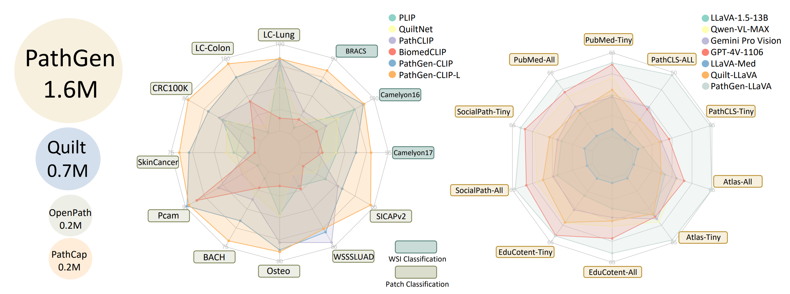
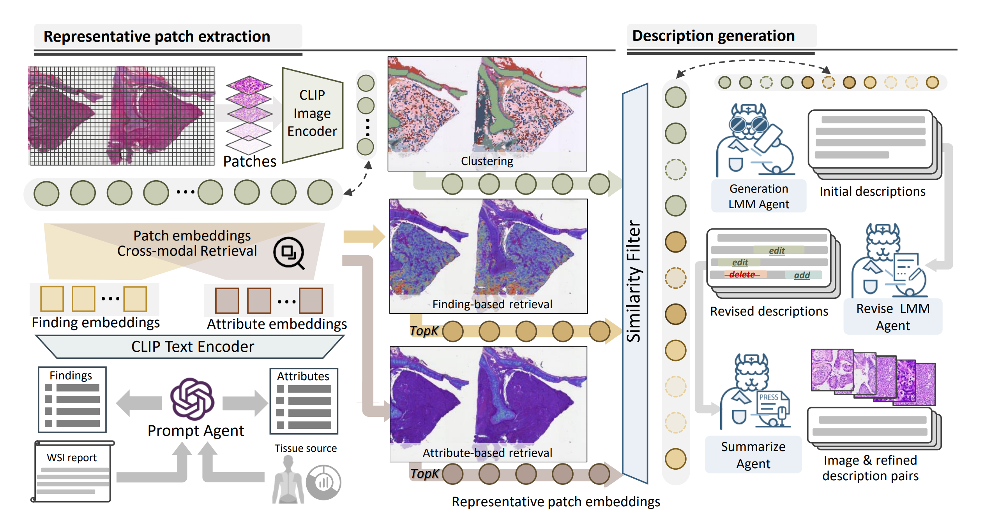

# PathGen-1.6M

This is the official repo for  [**PathGen-1.6M: 1.6 Million Pathology Image-text Pairs Generation through Multi-agent Collaboration**](https://arxiv.org/abs/2407.00203)

[**Dataset**](https://huggingface.co/datasets/jamessyx/PathGen)

## Abstract

Vision Language Models (VLMs) like CLIP have attracted substantial attention in pathology, serving as backbones for applications such as zero-shot image classification and Whole Slide Image (WSI) analysis. Additionally, they can function as vision encoders when combined with large language models (LLMs) to support broader capabilities. Current efforts to train pathology VLMs rely on pathology image-text pairs from platforms like PubMed, YouTube, and Twitter, which provide limited, unscalable data with generally suboptimal image quality. In this work, we leverage large-scale WSI datasets like TCGA to extract numerous high-quality image patches. We then train a large multimodal model to generate captions for these images, creating PathGen-1.6M, a dataset containing 1.6 million high-quality image-caption pairs. Our approach involves multiple agent models collaborating to extract representative WSI patches, generating and refining captions to obtain high-quality image-text pairs. Extensive experiments show that integrating these generated pairs with existing datasets to train a pathology-specific CLIP model, PathGen-CLIP, significantly enhances its ability to analyze pathological images, with substantial improvements across nine pathology-related zero-shot image classification tasks and three whole-slide image tasks. Furthermore, we construct 200K instruction-tuning data based on PathGen-1.6M and integrate PathGen-CLIP with the Vicuna LLM to create more powerful multimodal models through instruction tuning. Overall, we provide a scalable pathway for high-quality data generation in pathology, paving the way for next-generation general pathology models.



## Method



We employ multiple agents working collaboratively to generate high-quality pathology image-text pairs. This process involves extracting representative WSI image patches by generating text prompts for CLIP to retrieve the most relevant patches. These patches are then described by a trained pathology LMM agent, followed by another LMM agent that revises and summarizes the descriptions. 

## Usage of PathGen-1.6M Dataset

Download the PathGen Dataset:

> #### Step1:

Access and download the JSON file containing image names, specific positions, and captions from the [**Dataset**](https://huggingface.co/datasets/jamessyx/PathGen). This file is critical for the subsequent steps as it provides the necessary metadata.

Data example:

```json
{
    "wsi_id": "TCGA-AA-3844-01Z-00-DX1.bf88ce1f-0601-40c8-813e-4e3df51bd2f0",
    "position": [
      "35136",
      "33344"
    ],
    "caption": "The colon tissue exhibits pleomorphism, hyperchromatic nuclei, and irregular glandular architecture, indicative of a neoplastic process. Stroma shows inflammatory infiltration and increased cellularity, suggesting a desmoplastic reaction. These characteristics potentially point to adenocarcinoma, requiring further clinical and molecular correlation for a definitive diagnosis.",
    "file_id": "bffacf34-4942-496d-9c5d-d36294d80a9d"
}
```

> #### Step2:

Employ the GDC Data Transfer Tool to download the whole-slide images (.svs files) referenced in the JSON file. Detailed instructions for using this tool can be found on the GDC's documentation page: https://docs.gdc.cancer.gov/Data_Transfer_Tool/Users_Guide/Getting_Started/.

A simple approach is to use the `file_id` field provided by PathGen-1.6M and download the file using `gdc-client download <file_id>`.

> #### Step3:

Follow the following code to gather image-caption pairs.

```python
import os
import json
from PIL import Image
import openslide

# Define paths and configuration
WSI_DIR = "/path/to/your/wsi/files"  # Update this to the directory containing your WSI files
OUTPUT_DIR = "./output"  # Directory where patches and captions will be saved
PATCH_SIZE = (672, 672)  # Size of the patch to extract

# Ensure output directory exists
os.makedirs(OUTPUT_DIR, exist_ok=True)

# Load the list of WSIs with positions and captions
# data = [
#     {
#         "WSI_id": "TCGA-22-5474-01Z-00-DX1.8736FB24-7E65-4ACB-9325-382D7F864F62",
#         "position": ["41024", "35104"],
#         "caption": "The tissue image reveals dense cellular infiltration, suggesting inflammation, and cells with large, hyperchromatic nuclei and high nuclear-to-cytoplasmic ratios indicative of a neoplastic process. Pink, acellular material points to fibrosis or connective tissue. The disrupted architecture further supports a pathological condition, possibly cancer combined with fibrotic changes."
#     },
#     {
#         "WSI_id": "TCGA-55-8621-01Z-00-DX1.7C519007-D59D-432A-BF4D-23D14A1C8BB6",
#         "position": ["13280", "13056"],
#         "caption": "The lung tissue image displays myofibroblasts with elongated nuclei and eosinophilic cytoplasm, indicative of collagen-rich fibrosis. Epithelial cells, forming glandular structures, show cellular atypia. The architecture is disrupted by dense fibrotic areas and patchy cellular infiltration, suggesting an interstitial lung disease characterized by chronic fibrosis and inflammation. Hemorrhage or hemosiderin deposits are not evident."
#     },
#     {
#         "WSI_id": "TCGA-AH-6547-01Z-00-DX1.73040c3e-8219-4d21-88f2-613218d32297",
#         "position": ["5472", "8320"],
#         "caption": "The tissue shows irregular, atypical glandular structures indicative of adenocarcinoma, with hyperchromatic nuclei, high nuclear-to-cytoplasmic ratio, and pleomorphism. Desmoplastic stroma and mitotic figures suggest high-grade dysplasia. These features confirm a diagnosis of malignant adenocarcinoma of the rectum, characterized by loss of normal glandular architecture and cellular disorganization."
#     }
# ]
pathgen_data_path = 'PathGen-1.6M.json'
with open(pathgen_data_path, 'r') as f:
    data = json.load(f)

def extract_patch_from_wsi(wsi_path, position, patch_size):
    """
    Extracts a patch from the WSI at the specified position.

    :param wsi_path: Path to the WSI file.
    :param position: Tuple of (x, y) coordinates.
    :param patch_size: Size of the patch to extract.
    :return: Extracted patch as a PIL Image.
    """
    try:
        # Load WSI using OpenSlide
        wsi = openslide.OpenSlide(wsi_path)
        x, y = map(int, position)  # Convert position coordinates to integers
        patch = wsi.read_region((x, y), 0, patch_size)  # Extract patch
        return patch
    except Exception as e:
        print(f"Error extracting patch from {wsi_path} at {position}: {e}")
        return None


# Process each WSI and its corresponding data
for item in data:
    wsi_id = item['WSI_id']
    position = item['position']
    caption = item['caption']

    # Construct the full path to the WSI file
    wsi_path = os.path.join(WSI_DIR, f"{wsi_id}.svs")  # Update extension if different

    # Extract the patch
    patch = extract_patch_from_wsi(wsi_path, position, PATCH_SIZE)

    if patch:
        # Save the patch as an image file
        patch_filename = f"{wsi_id}_{position[0]}_{position[1]}.png"
        patch_path = os.path.join(OUTPUT_DIR, patch_filename)
        patch.save(patch_path)

        # Save the caption in a text file
        caption_filename = f"{wsi_id}_{position[0]}_{position[1]}.txt"
        caption_path = os.path.join(OUTPUT_DIR, caption_filename)
        with open(caption_path, 'w') as caption_file:
            caption_file.write(caption)

        print(f"Extracted and saved patch and caption for {wsi_id} at position {position}")
    else:
        print(f"Failed to extract patch for {wsi_id} at position {position}")
```

This step creates the final PathGen-1.6M image-caption pairs.


## Usage of PathGen-Instruct Dataset

The usage of PathGen-Instruct and PathGen-1.6M is the same. To facilitate training of the LMM model (LLaVA), we have converted the dataset into a format that can be directly used as input for LLaVA. You can download the dataset at [**PathGen-Instruct**](https://huggingface.co/datasets/jamessyx/PathInstruct) .

Data example:

```json
[{
    "id": "107770",
    "image": "TCGA-LD-A66U-01Z-00-DX1.AEC25C62-0519-47ED-A85B-2A964BA2BA87/17120_34976.jpg",
    "conversations": [
      {
        "from": "human",
        "value": "What is indicated by the presence of scattered inflammatory cells in the tissue?\nA) Acute inflammation\nB) Active thrombosis\nC) Normal tissue architecture\nD) Chronic inflammation\n\nFrom the choices provided, select the one that best matches the image content. Respond with only the letter.Answer with the option''s letter from the given choices directly.\n<image>"
      },
      {
        "from": "gpt",
        "value": "A"
      }
    ],
    "type": "CLOSE",
    "wsi_id": "TCGA-LD-A66U-01Z-00-DX1.AEC25C62-0519-47ED-A85B-2A964BA2BA87",
    "file_id": "734d4a72-94ad-4274-8f14-0a9abaee1b0d",
    "position": [
      "17120",
      "34976"
    ]
  },
  {
    "id": "183903",
    "image": "TCGA-B9-4117-01Z-00-DX1.9c2239e4-0bff-4482-914d-fd59afde75ab/82656_17120.jpg",
    "conversations": [
      {
        "from": "human",
        "value": "<image>\nWhat features within the glomerulus suggest an active inflammatory process?"
      },
      {
        "from": "gpt",
        "value": "The glomerulus exhibits marked hypercellularity, meaning an increased number of cells within the tuft compared to normal. This increase likely involves endothelial cells, mesangial cells, and infiltrating inflammatory cells (though specific types are hard to discern definitively on H&E alone). Additionally, the presence of extravasated red blood cells (hemorrhage) within Bowman's space and potentially within the tuft indicates damage to the glomerular capillary walls, a common feature of active glomerulonephritis."
      },
      {
        "from": "human",
        "value": "Which visible changes indicate that the kidney injury process is chronic?"
      },
      {
        "from": "gpt",
        "value": "While the hypercellular glomerulus indicates active inflammation, signs of chronicity are suggested by the surrounding tissue changes mentioned in the description, such as tubular atrophy/dilation and interstitial fibrosis. Although not perfectly clear in this specific high-power field alone without comparison to less affected areas, the description implies these features are present in the overall sample. Fibrosis (interstitial scarring) and irreversible tubular changes (atrophy/dilation) are hallmarks of long-standing damage, distinguishing it from a purely acute process."
      },
      {
        "from": "human",
        "value": "How do the combined glomerular and tubulointerstitial changes reflect the overall kidney function?"
      },
      {
        "from": "gpt",
        "value": "The combination of glomerular hypercellularity/hemorrhage (indicating glomerulonephritis) and the described tubulointerstitial damage (atrophy, dilation, fibrosis, inflammation) signifies injury to multiple functional compartments of the nephron. Glomerular damage impairs filtration, while tubular and interstitial damage impairs reabsorption, secretion, and concentrating ability, leading to progressive loss of overall kidney function. The presence of fibrosis indicates irreversible scarring, consistent with chronic kidney disease potentially progressing towards end-stage renal failure."
      }
    ],
    "type": "OPEN",
    "wsi_id": "TCGA-B9-4117-01Z-00-DX1.9c2239e4-0bff-4482-914d-fd59afde75ab",
    "file_id": "8bbbfc1f-d946-476d-ad78-728b2ebd927c",
    "position": [
      "82656",
      "17120"
    ]
  }, .....
]
```


## Usage of Trained PathGen-CLIP series model

The trained PathGen-CLIP can be downloaded via  [**PathGen-CLIP**](https://pub-7a38cc906afa44a4a01533c288d0b1af.r2.dev/pathgenclip.pt) and the PathGen-CLIP-L via  [**PathGen-CLIP-L**](https://huggingface.co/jamessyx/PathGen-CLIP-L) (We also transform PathGen-CLIP-L to HF version [**PathGenCLIP-vit-large-patch14-hf**](https://huggingface.co/jamessyx/pathgenclip-vit-large-patch14-hf)  to facilitate the integration into LLM).

```
pip install open_clip_torch
```

```python
import torch
from PIL import Image
import open_clip

model, _, preprocess = open_clip.create_model_and_transforms('ViT-B-16', pretrained='path/pathgen-clip.pt') // PathGen-CLIP
# model, _, preprocess = open_clip.create_model_and_transforms('ViT-B-16', pretrained='path/pathgen-clip-l.pt') // PathGen-CLIP-L
model.eval()  # model in train mode by default, impacts some models with BatchNorm or stochastic depth active
tokenizer = open_clip.get_tokenizer('ViT-B-16')

image = preprocess(Image.open("example.png")).unsqueeze(0)
text = tokenizer(["An H&E image of tumor patch", "An H&E image of normal patch"])

with torch.no_grad(), torch.cuda.amp.autocast():
    image_features = model.encode_image(image)
    text_features = model.encode_text(text)
    image_features /= image_features.norm(dim=-1, keepdim=True)
    text_features /= text_features.norm(dim=-1, keepdim=True)

    text_probs = (100.0 * image_features @ text_features.T).softmax(dim=-1)

print("Label probs:", text_probs)
```


## Usage of Trained PathGen-LLaVA

The trained PathGen-LLaVA can be downloaded via  [**PathGen-LLaVA**](https://huggingface.co/jamessyx/PathGen-LLaVA). As we use our PathGen-CLIP-L as the PathGen-LLaVA's  vision encoder, so you need  to replace the vision encoder path in the config as the PathGen-CLIP-L-hf's path (where can be downloaded in this [link](https://huggingface.co/jamessyx/PathGen-LLaVA/tree/main/pathgenclip-vit-large-patch14))

This model is based on 🌋 LLaVA: Large Language and Vision Assistant so model architecture and training scripts are heavily borrowed from https://github.com/haotian-liu/LLaVA.

You can fully adopt the LLaVA framework to conduct inferring of this model.

## **Citation**

```
@article{sun2024pathgen,
  title={Pathgen-1.6 m: 1.6 million pathology image-text pairs generation through multi-agent collaboration},
  author={Sun, Yuxuan and Zhang, Yunlong and Si, Yixuan and Zhu, Chenglu and Shui, Zhongyi and Zhang, Kai and Li, Jingxiong and Lyu, Xingheng and Lin, Tao and Yang, Lin},
  journal={arXiv preprint arXiv:2407.00203},
  year={2024}
}
```

